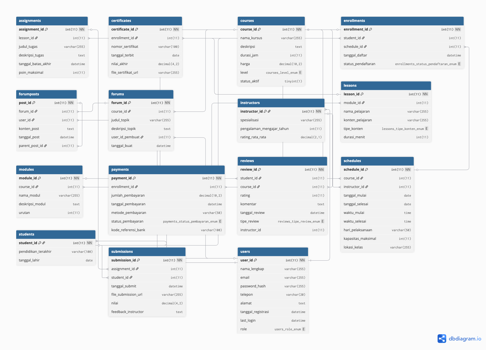

# ProjekUAS
Projek UAS Mata Kuliah Pemrograman WEB ( Pengampu Mata Kuliah : Ir. Abadi Nugraha, S.Kom, M.Kom )
---
## Documentasi

https://youtu.be/eRmWKE0ehrE
[](https://youtu.be/eRmWKE0ehrE)

### Cara Instalasi Singkat ( Highlight Langkah Penting )
  1. Persiapan
     - Pastikan Sudah Menginstall Aplikasi XAMPP / LAMP
     - Letakkan Folder Project ke dalam HTDocs ( Jika menggunakan XAMPP )
  3. Konfigurasi Database
     - import database.sql ke phpmyadmin
     - sesuaikan konfigurasi koneksi pada database di file `koneksi.php`
     - penyesuaian terdiri dari nama host, nama user database, password database, dan nama database
     - penyesuaian dilakukan di `$koneksi = mysqli_connect("localhost","root","","nama_database");`
  5. Jalankan Aplikasi
     Buka Browser dan akses http://localhost/ITLearning
  7. Login
     Login dengan akun yang telah didaftarkan.
---
**Desain Database Aplikasi Kursus Komputer "IT Learning"**

Aplikasi "IT Learning" akan mengelola data terkait kursus, siswa, pengajar, jadwal,
pembayaran, dan elemen pendukung lainnya untuk memfasilitasi proses belajar
mengajar.



**1. Users (Pengguna)**
Tabel ini menyimpan informasi dasar untuk semua pengguna sistem, baik siswa,
pengajar, maupun admin.
- user_id (PK) - INT, Auto Increment
- nama_lengkap - VARCHAR(255)
- email - VARCHAR(255), UNIQUE
- password_hash - VARCHAR(255)
- telepon - VARCHAR(20)
- alamat - TEXT
- tanggal_registrasi - DATETIME
- last_login - DATETIME
- role - ENUM('siswa', 'pengajar', 'admin')

**2. Students (Siswa)**
Tabel ini menyimpan detail khusus untuk pengguna dengan peran 'siswa'.
- student_id (PK) - INT, FK ke Users.user_id
- pendidikan_terakhir - VARCHAR(100)
- tanggal_lahir - DATE

**3. Instructors (Pengajar)**
Tabel ini menyimpan detail khusus untuk pengguna dengan peran 'pengajar'.
- instructor_id (PK) - INT, FK ke Users.user_id
- spesialisasi - VARCHAR(255) (Misal: Programming, Desain Grafis, Jaringan)
- pengalaman_mengajar_tahun - INT
- rating_rata_rata - DECIMAL(2,1)

**4. Courses (Kursus)**
Tabel ini mendefinisikan berbagai kursus yang ditawarkan.
- course_id (PK) - INT, Auto Increment
- nama_kursus - VARCHAR(255)
- deskripsi - TEXT
- durasi_jam - INT
- harga - DECIMAL(10,2)
- level - ENUM('Dasar', 'Menengah', 'Lanjut')
- status_aktif - BOOLEAN (Apakah kursus masih ditawarkan)

**5. Modules (Modul)**
Tabel ini membagi kursus menjadi modul-modul yang lebih kecil.
- module_id (PK) - INT, Auto Increment
- course_id (FK) - INT, Referensi ke Courses.course_id
- nama_modul - VARCHAR(255)
- deskripsi_modul - TEXT
- urutan - INT (Urutan modul dalam kursus)

**6. Lessons (Pelajaran)**
Tabel ini menyimpan detail pelajaran di setiap modul.
- lesson_id (PK) - INT, Auto Increment
- module_id (FK) - INT, Referensi ke Modules.module_id
- nama_pelajaran - VARCHAR(255)
- konten_pelajaran - TEXT (Bisa berupa teks, URL video, link ke materi)
- tipe_konten - ENUM('teks', 'video', 'pdf', 'link')
- durasi_menit - INT

**7. Schedules (Jadwal)**
Tabel ini menentukan jadwal spesifik untuk setiap kelas kursus.
- schedule_id (PK) - INT, Auto Increment
- course_id (FK) - INT, Referensi ke Courses.course_id
- instructor_id (FK) - INT, Referensi ke Instructors.instructor_id
- tanggal_mulai - DATE
- tanggal_selesai - DATE
- waktu_mulai - TIME
- waktu_selesai - TIME
- hari_pelaksanaan - VARCHAR(50) (Contoh: "Senin, Rabu, Jumat" atau
    "Sabtu")
- kapasitas_maksimal - INT
- lokasi_kelas - VARCHAR(255) (Online/Offline)

**8. Enrollments (Pendaftaran Kursus)**
Tabel ini mencatat pendaftaran siswa ke suatu jadwal kursus.
- enrollment_id (PK) - INT, Auto Increment
- student_id (FK) - INT, Referensi ke Students.student_id
- schedule_id (FK) - INT, Referensi ke Schedules.schedule_id
- tanggal_daftar - DATETIME
- status_pendaftaran - ENUM('pending', 'diterima', 'ditolak', 'selesai',
    'dibatalkan')

**9. Payments (Pembayaran)**
Tabel ini mencatat detail transaksi pembayaran.
- payment_id (PK) - INT, Auto Increment
- enrollment_id (FK) - INT, Referensi ke Enrollments.enrollment_id
- jumlah_pembayaran - DECIMAL(10,2)
- tanggal_pembayaran - DATETIME
- metode_pembayaran - VARCHAR(50) (Contoh: Bank Transfer, E-wallet)
- status_pembayaran - ENUM('pending', 'sukses', 'gagal', 'dikembalikan')
- kode_referensi_bank - VARCHAR(100) (Jika ada)

**10. Certificates (Sertifikat)**
Tabel ini menyimpan data sertifikat yang diterbitkan setelah siswa menyelesaikan
kursus.
- certificate_id (PK) - INT, Auto Increment
- enrollment_id (FK) - INT, Referensi ke Enrollments.enrollment_id
- nomor_sertifikat - VARCHAR(100), UNIQUE
- tanggal_terbit - DATE
- nilai_akhir - DECIMAL(4,2) (Jika ada penilaian)
- file_sertifikat_url - VARCHAR(255)

**11. Assignments (Tugas)**
Tabel ini mendefinisikan tugas untuk setiap pelajaran atau modul.
- assignment_id (PK) - INT, Auto Increment
- lesson_id (FK) - INT, Referensi ke Lessons.lesson_id
- judul_tugas - VARCHAR(255)
- deskripsi_tugas - TEXT
- tanggal_batas_akhir - DATETIME
- poin_maksimal - INT

**12. Submissions (Pengumpulan Tugas)**
Tabel ini mencatat pengumpulan tugas oleh siswa.
- submission_id (PK) - INT, Auto Increment
- assignment_id (FK) - INT, Referensi ke Assignments.assignment_id
- student_id (FK) - INT, Referensi ke Students.student_id
- tanggal_submit - DATETIME
- file_submission_url - VARCHAR(255)
- nilai - DECIMAL(4,2)
- feedback_instructor - TEXT

**13. Forums (Forum Diskusi)**
Tabel ini mengelola topik diskusi untuk setiap kursus atau modul.
- forum_id (PK) - INT, Auto Increment
- course_id (FK) - INT, Referensi ke Courses.course_id
- judul_topik - VARCHAR(255)
- deskripsi_topik - TEXT
- user_id_pembuat (FK) - INT, Referensi ke Users.user_id (Siapa yang membuat topik)
- tanggal_buat - DATETIME

**14. ForumPosts (Postingan Forum)**
Tabel ini menyimpan setiap postingan atau balasan di forum.
- post_id (PK) - INT, Auto Increment
- forum_id (FK) - INT, Referensi ke Forums.forum_id
- user_id (FK) - INT, Referensi ke Users.user_id (Siapa yang memposting)
- konten_post - TEXT
- tanggal_post - DATETIME
- parent_post_id (FK) - INT, NULLABLE (Untuk balasan, referensi ke post_id
    induk)

**15. Reviews (Ulasan/Rating)**
Tabel ini menyimpan ulasan dan rating yang diberikan siswa untuk kursus atau
pengajar.
- review_id (PK) - INT, Auto Increment
- student_id (FK) - INT, Referensi ke Students.student_id
- course_id (FK) - INT, Referensi ke Courses.course_id (Atau instructor_id
    jika ulasan pengajar)
- rating - INT (1-5)
- komentar - TEXT
- tanggal_review - DATETIME
- tipe_review - ENUM('kursus', 'pengajar')

**Relasi Antar Tabel**

Berikut adalah gambaran relasi antar tabel:

- **One-to-One:**
1. Users (user_id) **- >** Students (student_id)
2. Users (user_id) **- >** Instructors (instructor_id)

- **One-to-Many:**
1. Courses (course_id) **- >** Modules (course_id)
2. Modules (module_id) **- >** Lessons (module_id)
3. Courses (course_id) **- >** Schedules (course_id)
4. Instructors (instructor_id) **- >** Schedules (instructor_id)
5. Schedules (schedule_id) **- >** Enrollments (schedule_id)
6. Students (student_id) **- >** Enrollments (student_id)
7. Enrollments (enrollment_id) **- >** Payments (enrollment_id)
8. Enrollments (enrollment_id) **- >** Certificates (enrollment_id)
9. Lessons (lesson_id) **- >** Assignments (lesson_id)
10. Assignments (assignment_id) **- >** Submissions (assignment_id)
11. Students (student_id) **- >** Submissions (student_id)
12. Courses (course_id) **- >** Forums (course_id)
13. Forums (forum_id) **- >** ForumPosts (forum_id)
14. Users (user_id) **- >** ForumPosts (user_id)
15. Students (student_id) **- >** Reviews (student_id)
16. Courses (course_id) **- >** Reviews (course_id)
17. Instructors (instructor_id) **- >** Reviews (instructor_id) (opsional, jika review khusus pengajar)

- **Many-to-Many (melalui tabel perantara):**
1. Siswa & Kursus: Melalui Enrollments (Siswa mendaftar ke Kursus melalui Jadwal)
2. Pengajar & Kursus: Melalui Schedules (Pengajar mengajar Kursus melalui Jadwal)

---
# 🧭 Alur Penggunaan Aplikasi IT Learning

Dokumentasi alur penggunaan lengkap untuk setiap jenis pengguna dalam sistem pembelajaran daring "IT Learning".

---

## 👩‍💼 1. Admin

### Alur Aktivitas:

1. Login sebagai Admin
2. Akses Dashboard: lihat statistik siswa, pengajar, dan kursus
3. Kelola User:
   - Tambah/edit/hapus siswa & pengajar
4. Kelola Kursus:
   - Tambah/edit kursus, ubah status aktif
5. Atur Jadwal Kursus:
   - Tentukan pengajar, waktu, lokasi
6. Pantau Pendaftaran & Pembayaran
7. Pantau Aktivitas Forum
8. Lihat Ulasan & Penilaian dari siswa
9. Logout

---

## 👨‍🏫 2. Pengajar

### Alur Aktivitas:

1. Login sebagai Pengajar
2. Akses Dashboard: lihat kursus yang diajar dan jadwal kelas
3. Kelola Materi:
   - Tambah modul & pelajaran
   - Upload konten (teks, video, PDF)
4. Kelola Tugas:
   - Buat tugas untuk pelajaran
   - Tentukan deadline dan poin
5. Nilai Tugas:
   - Lihat pengumpulan tugas
   - Berikan nilai dan komentar
6. Kelola Jadwal Kelas
7. Ikuti Diskusi Forum:
   - Balas pertanyaan dari siswa
8. Lihat Ulasan
9. Edit Profil
10. Logout

---

## 👨‍🎓 3. Siswa

### Alur Aktivitas:

1. Registrasi akun (isi data lengkap)
2. Login sebagai Siswa
3. Akses Dashboard: lihat status kursus, jadwal, sertifikat
4. Daftar Kursus:
   - Pilih jadwal
   - Kirim pendaftaran
5. Lakukan Pembayaran
6. Akses Materi:
   - Pelajari modul dan pelajaran
7. Kerjakan Tugas:
   - Lihat dan kumpulkan tugas
   - Cek nilai dan feedback
8. Ikuti Forum:
   - Ajukan pertanyaan
   - Balas diskusi lain
9. Unduh Sertifikat setelah menyelesaikan kursus
10. Berikan Review/Ratings
11. Edit Profil
12. Logout

---

## 🔁 Alur Umum Sederhana

```text
SISWA:
→ Registrasi → Login → Daftar Kursus → Bayar → Belajar
→ Kerjakan Tugas → Forum → Sertifikat → Review

PENGAJAR:
→ Login → Kelola Materi → Kelola Tugas → Nilai → Forum

ADMIN:
→ Login → Kelola User/Kursus → Jadwal → Pantau Proses
